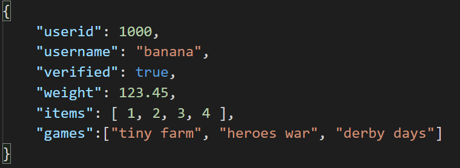
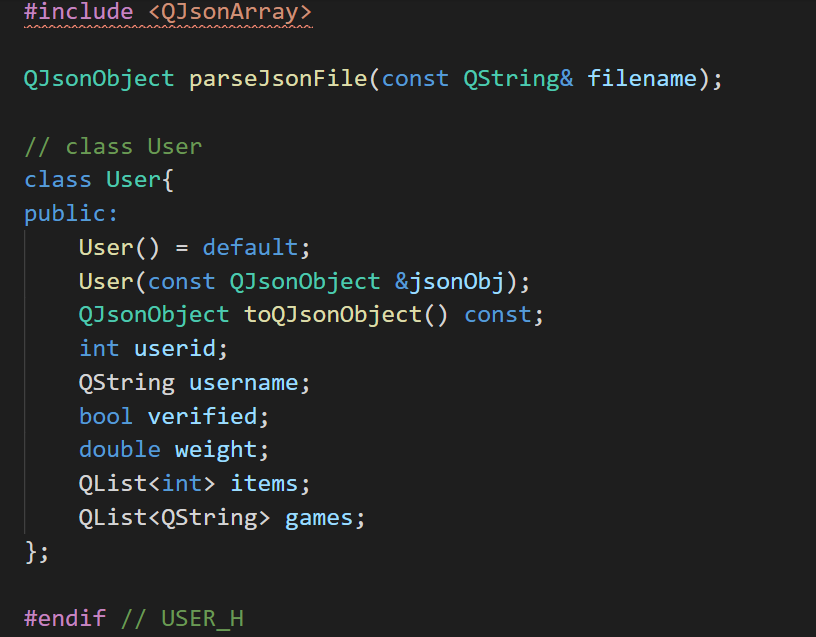
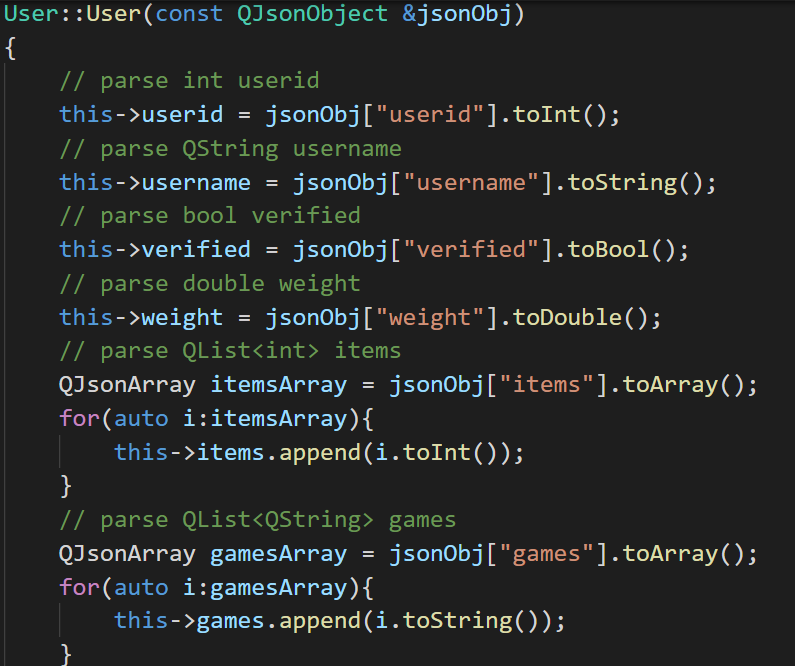

# Json2Qt

A Qt code generator to automatically translate JSON to Qt class type.

## Introduction

JSON is a popular data format in many areas. 

Reading and writing the JSON file in C++ is very painful and wasting time, especially when we are warp some RestFul API.

There were some tool in C++ to manage this task like [json2cpp.py],[autojsoncxx],[quicktype],[QtJsonSerializer] ... ,but its eather not use Qt API or hard to install.

There is no dependicy of python modules.

## How to use

``` bash
python Json2Qt.py -i user.json
```

The json file:


will create to `user.h`:


and `user.cpp`:


1. Add the generated file `user.h` and `user.cpp` to your project.
2. Use `QJsonObject parseJsonFile(const QString& filename)` function to turn file into `QJsonObject`.
3. Use `User` object construct by `QJsonObject`.

- Turn object to `QJsonObject`, use `QJsonObject toQJsonObject() const` function.
- Save `User` to JSON file, use `QJsonDocument(user.toQJsonObject()).toJson()` [QJsonDocument]

``` c++
#include "user.h"

QJsonObject jsonObj = parseJsonFile("user.json");
auto user = User(jsonObj);
qDebug() << "User:" << user.toQJsonObject();
```

## Bugs

I didn't process the variable name from the JSON file.
So the variable name like {"image/jpeg":["application/vnd.google-apps.document"]} will turn to `QString image/jpeg;`.

## Reference

[json2cpp.py]:      https://gist.github.com/soharu/5083914
[autojsoncxx]:      https://netheril96.github.io/autojsoncxx/
[quicktype]:        https://app.quicktype.io/
[QtJsonSerializer]: https://github.com/Skycoder42/QtJsonSerializer
[QJsonDocument]:    https://doc.qt.io/qt-5/qjsondocument.html#toJson-1